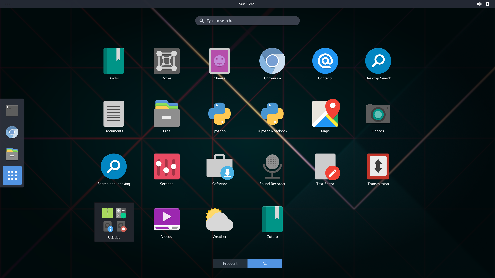
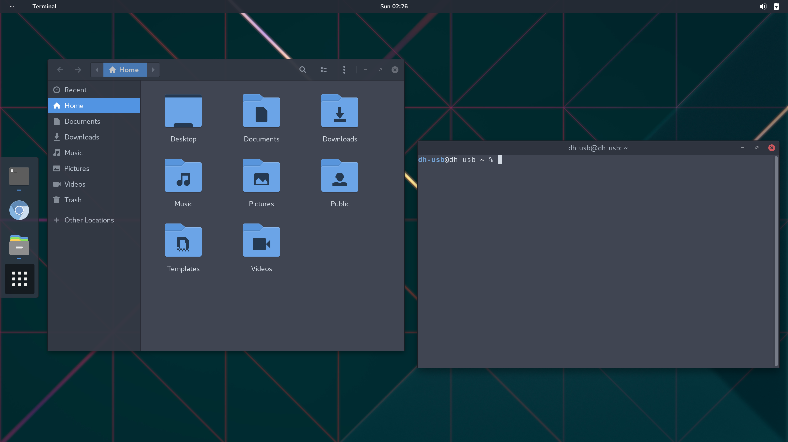

# About
DH-USB is a [digital humanities](https://en.wikipedia.org/wiki/Digital_humanities) operating system on a USB disk. It’s an opinionated adaptation of Arch Linux, customized for use by digital humanists, text analysts, data scientists, corpus linguists, and anyone else that works with text as data. Download the USB image files over BitTorrent using [the .torrent files in the /torrents directory](https://github.com/JonathanReeve/dh-usb/tree/master/torrents). 

## Software Included
 - **Desktop Environment**: GNOME
 - **Programming Languages**: Python 3, Ruby 
 - **IDEs**: Jupyter, Jupyter Notebook, iPython
 - **Text Editors**: Vim, Gedit
 - **Web Browsing**: Chromium (open-source Google chrome)  
 - **Web Development**: Jekyll
 - **Document management**: Pandoc, pandoc-citeproc, pandoc-crossref
 - **Bibliographic Management**: Zotero

There are two flavors of DH-USB: 
 - **16GB**: contains only the software listed above, and is suitable for 16G drives. 
 - **32GB**: contains all of the software listed above, but adds a number of new Python libraries, like SpaCy, Numpy, and Pandas. Additionally, it includes all of SpaCy’s data and the NLTK “book” data. This requires at least a 32G drive. 

## FAQ

### Will this change anything on my computer?

No. DH-USB runs completely from its USB disk, and all of your work is saved to this USB drive. Your computer’s internal hard drive is not affected at all unless you explictly mount it.

### Is DH-USB compatible with my computer? 

DH-USB runs on x86_64 systems with UEFI bootloaders. That’s just about any desktop or laptop, with the exception of Chromebooks, made in the past 5 years. If you want to get it to work on an older system, you might be able to, by building it yourself (instructions below) and replacing `systemd-boot` with `grub`. 

### How can I get it?

Zipped disk image files are downloadable via BitTorrent, using the .torrent files in the `/torrents` directory of this repository. Once your download has completed, please keep seeding it, as this will make it easier for others to download. 

### How can I write the .img file to my USB drive?

Detailed installation instructions are included in [README-installation.md](https://github.com/JonathanReeve/dh-usb/blob/master/README-installation.md), but basically you just write the .img file to a disk. There are plenty of .img file writers out there that will help.

### Is this a “live disk”?

This isn’t a live USB, like most Linux distributions you can download; it’s actually a full Linux install. Live USBs run on read-only filesystems that freeze the kernel and other system files to a particular state, but DH-USB is identical to a full install you would have on your hard drive.

### I’ve created a USB disk with DH-USB on it. Now how do I boot from it? 

This depends on your system. On a PC, you typically press some key on boot time, like F10, and this will bring up a boot menu where you can opt to boot from the USB. Check your computer’s documentation for the correct key to press. On a Mac, you have to hold down Option (Alt) while booting, and then select “EFI Boot” when prompted.

### How is this different from DHBox? 

This is a sister project of DHBox, and meant to complement it. DHBox is better for casual computing, workshops, and trying out new tools, but DH-USB is better for when you want to run intensive computations on your own machine, but don’t yet want to install Linux to your own HD.

### Does the world really need another Linux distribution? 

Probably not. But I couldn’t find one that is made to be run from a USB drive. Adding a digital humanities laboratory to it is a plus.

### Why Arch Linux? Why not something more user-friendly, like Ubuntu? 

Arch is rolling-release, which means that it always has the latest software. In contrast, Ubuntu freezes its software versions every six months, and in some cases has very old software. Python 3 is also the default on Arch, while Ubuntu still uses Python 2. 

### What about R? 

I’ve removed the R programming language by default, despite its widespread use in text analysis, but it is easily installable with the Software app, or on the commandline via `sudo pacman -S r`. Similarly, you can install R-Studio with `yaourt install rstudio-desktop-bin`. 

### What about Omeka, WordPress, or other digital humanities tools? 

I’ve left cloud-based software off of DH-USB, for the moment, since DH-USB is meant to be run locally. That having been said, the LAMP stacks that run Omeka and WordPress are easy to install on DH-USB. Just run `sudo pacman -S apache mariadb php`. Then, to install Omeka or WordPress, you can follow their installation guides. I have [a guide to installing Omeka on a Ubuntu server](http://programminghistorian.org/lessons/installing-omeka), for instance, and this can be used to install Omeka. Simply skip to Step 3. For WordPress, you can install the version from the AUR with `yaourt wordpress`, or follow the [Famous 5-Minute Installation](https://codex.wordpress.org/Installing_WordPress#Famous_5-Minute_Install) guide. 

### Can I add more software? 

Absolutely. Just use the program called “Software,” or run the command `sudo pacman -S package-name-here`, substituting the name of the software package you want to install.

### How can I personalize DH-USB?

First, you’ll probably want to change the root password as soon as you can, either through the Users program or on the command line, with `passwd`. With the Users program, you can also change your profile picture. Use the Online Accounts program to enter your Google or other account information, which will ensure integration with all of GNOME’s apps. 

# Manually Building

If you’re a DIY kind of person, and you’d like to build DH-USB from scratch, the build script `install.sh` will do that. It’s capable of either creating an .img file, which can then be written to a disk, or of writing directly to the disk itself. **Please do not run the install.sh script, or any of the other scripts in this repository, unless you really know what you’re doing.** That having been said, here’s what you’ll need: 

 - a large USB drive, at least 16GB
 - a modern system that supports UEFI. Legacy BIOS boot may be possible, but it hasn’t been extensively tested.
 - Antergos Linux (or Arch Linux with the Antergos repositories in /etc/pacman.conf)
 - the Arch Linux package `arch-install-scripts`

## Usage
Figure out what device label your USB drive has with `sudo fdisk -l`. If it’s `/dev/sdb`, you don’t need to configure anything, but if it’s something else, like `/dev/sdc`, you’ll need to edit the script first. Once you’re absolutely sure that your disk label is correct, you can run this command, which will erase and partition your disk, install Arch and all the other software, and configure everything: 

    sudo ./install.sh big

If you just want the minimal OS, run `min` instead of `big`. For Hacker Mode, run `hacker`. To perform a subtask, run something like

    sudo ./install.sh files

Make sure to read the script first so that you know what’s happening. This script is not really intended for userspace usage, so bad things can happen to your system if you use it incorrectly.
